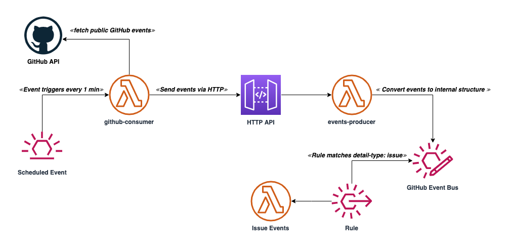

# Events Demo

Example architecture that pulls events and passes them to an API for processing and forwarding to EventBridge

## Architecture


This example pulls in 30 public events/activies from the [GitHub Activity API](https://docs.github.com/en/rest/reference/activity)
and then sends them to an API for processing. The _GitHub Consumer_ Lambda function, does some minor processing to wrap
the type with the activty body. It runs on a scheduled timer at a rate of once per minute through EventBridge's scheduled
rules.

The API expects a request, `POST /events` to contain a simple body:
```json
{
  "Type": "<activity type>",
  "Detail": "<payload>"
}
```
The body is parsed and converted into a payload that AWS EventBridge understands and forwards it to an
[Event Bus](https://docs.aws.amazon.com/eventbridge/latest/userguide/eb-event-bus.html).

At this point, you can write a [rule](https://docs.aws.amazon.com/eventbridge/latest/userguide/eb-rules.html) to match
either the type or something in the detail.

## Using this project
Ensure you have AWS credentials setup on your computer.

All of the Lambda functions included in this project are made with the Go programming language. In order to build the
functions, you will [require Go](https://golang.org/doc/install). You'll need to pull the dependecies down before building:
```sh
cd services
go mod download
go mod vendor
```

To build and deploy, you will require [AWS SAM CLI](https://docs.aws.amazon.com/serverless-application-model/latest/developerguide/serverless-sam-cli-install.html).

You can build the functions using the `sam build` command from the services directory. For your initial deployment, run `sam deploy --guided` to run through the deployment guide.